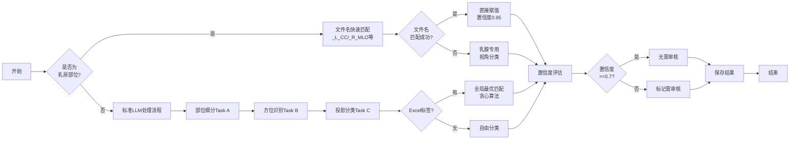
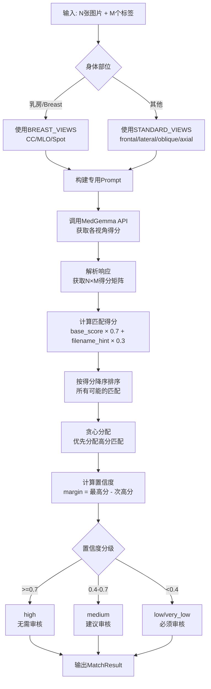
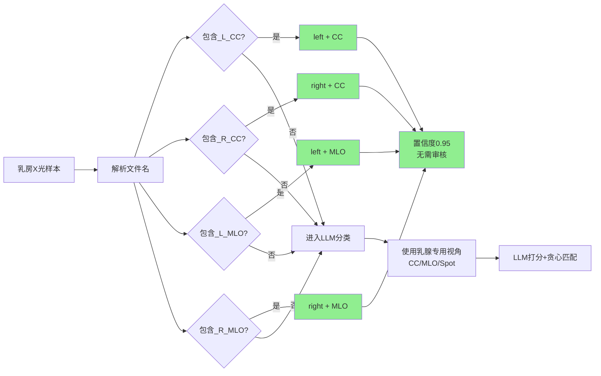
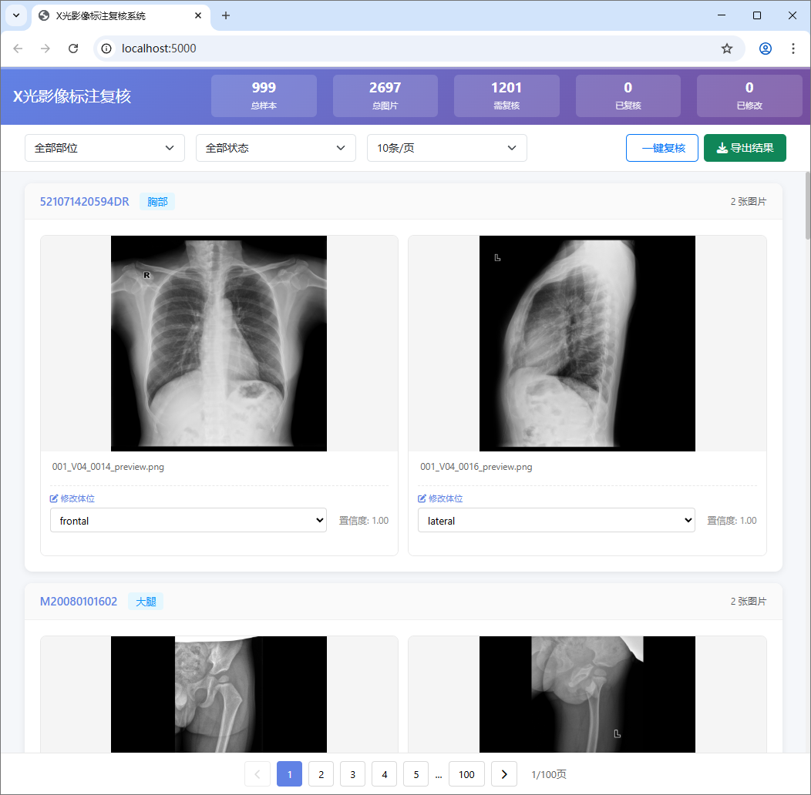

# MedGemma X-ray Labeling System

基于 MedGemma-1.5-4B-IT 多模态大语言模型的医学X光影像自动标注系统，支持部位识别、方位判断和拍摄体位分类，并提供交互式Web界面供人工复核。

## 功能特性

### 🤖 自动标注
- **部位识别**: 自动识别X光影像的身体部位（颈椎、腰椎、膝关节等25+部位）
- **方位判断**: 识别左右方位（left/right/bilateral）
- **体位分类**: 识别拍摄体位，支持标准几何视角和乳腺X光专用视角
- **智能匹配**: 使用改进的贪心算法进行多图多标签的全局最优匹配
- **置信度评估**: 为每个预测结果计算置信度，标记低置信度样本供复核
- **特殊部位优化**: 乳腺X光(MG)基于文件名关键词快速打标，跳过LLM调用

### 🖥️ Web复核界面
- **分页显示**: 支持每页5/10/20/50条样本
- **实时修改**: 支持修改方位和体位标签
- **自动保存**: 修改后自动保存到本地存储
- **筛选功能**: 按部位和复核状态筛选样本
- **智能状态管理**: 需复核样本与未复核样本合并显示，已复核样本独立标记
- **导出结果**: 导出JSON格式的修改记录
- **离线运行**: 所有静态资源已本地化，无需外网

### ⚡ 高效处理
- **多线程并发**: 支持多线程并行处理，提高效率
- **错误重试**: API调用失败自动重试3次
- **进度显示**: 实时显示处理进度和预估时间
- **结构化日志**: 完整的日志记录，便于排查问题
- **断点续传**: 支持从检查点恢复处理

---

## 系统架构

```mermaid
flowchart TB
    subgraph Input["📥 输入层"]
        A[selected_samples.xlsx<br/>样本元数据]
        B[data/{影像号}/png<br/>X光影像图片]
        C[part_exam_orientation.json<br/>部位配置映射]
    end
    
    subgraph Processing["⚙️ 处理层"]
        D[LLM_lable.py<br/>主处理程序]
        D1["Task A: 部位细分"]
        D2["Task B: 方位识别"]
        D3["Task C: 体位分类"]
        
        E[projection_matcher.py<br/>投影匹配算法]
        E1[标准几何视角<br/>frontal/lateral/oblique/axial]
        E2[乳腺专用视角<br/>CC/MLO/spot]
        
        F[特殊处理逻辑]
        F1[乳房文件名快速匹配<br/>_L_CC/_R_MLO等]
    end
    
    subgraph Output["📤 输出层"]
        G[processed_labels_v3.xlsx<br/>标注结果]
        H[logs/*.log<br/>结构化日志]
        I[checkpoint.json<br/>检查点]
    end
    
    subgraph Review["👁️ 复核层"]
        J[Web Review System<br/>Flask + Bootstrap]
        J1[分页展示]
        J2[实时修改]
        J3[自动保存]
        J4[状态筛选]
    end
    
    A --> D
    B --> D
    C --> D
    
    D --> D1 --> D2 --> D3
    D3 --> E
    
    E --> E1
    E --> E2
    
    D --> F
    F --> F1
    
    D --> G
    D --> H
    D --> I
    
    G --> J
    J --> J1
    J --> J2
    J --> J3
    J --> J4
```

---

## 核心算法流程

### 1. 整体处理流程



### 2. 投影匹配算法（贪心+置信度）



### 3. 乳房特殊处理流程



---

## 安装依赖

```bash
pip install -r requirements.txt
```

主要依赖：
- pandas >= 2.0.0
- numpy >= 1.24.0
- requests >= 2.31.0
- scipy >= 1.11.0
- flask >= 3.0.0
- openpyxl >= 3.1.0

---

## 快速开始

### 方式一：完整流水线（推荐）

一键完成标注和复核服务启动：

```bash
python run_pipeline.py --workers 4
```

浏览器将自动打开 http://localhost:5000 进入复核界面。

### 方式二：分步执行

#### 1. 运行LLM标注

```bash
python LLM_lable.py --workers 4
```

输出文件：`processed_labels_v3.xlsx`

#### 2. 启动复核Web服务

```bash
python web/app.py --port 5000
```

访问 http://localhost:5000 进行人工复核。

### 方式三：仅启动复核服务

如果已完成标注，只想启动复核服务：

```bash
python run_pipeline.py --review-only --port 5000
```

---

## 项目结构

```
Medgemma_label/
│
├── 核心模块/
│   ├── LLM_lable.py              # 主程序 - LLM标注
│   ├── projection_matcher.py     # 投影匹配算法（贪心+置信度）
│   ├── run_pipeline.py           # 完整流水线脚本
│   ├── medgamma_test.py          # API测试脚本
│   └── fix_breast_labels.py      # 乳房标签修复脚本
│
├── Web服务/
│   └── web/
│       ├── app.py                # Flask应用
│       ├── templates/
│       │   └── review.html       # 复核页面模板
│       └── static/               # 静态资源（已本地化）
│           ├── css/              # Bootstrap + Font Awesome
│           ├── js/               # Bootstrap JS
│           ├── webfonts/         # 字体文件
│           └── images/           # 占位图片
│
├── 数据/
│   ├── data/                     # X光图片目录
│   │   └── {影像号}/             # 按影像号组织的文件夹
│   │       ├── *.png             # X光图片
│   │       └── dicom_metadata_*.xlsx
│   ├── selected_samples.xlsx     # 样本列表（输入）
│   ├── processed_labels_v3.xlsx  # 标注结果（输出）
│   └── part_exam_orientation.json # 部位-体位配置映射
│
├── 配置/
│   ├── requirements.txt          # Python依赖
│   └── logs/                     # 日志目录
│
├── README.md                     # 本文件
└── AGENTS.md                     # 项目背景说明
```

---

## 使用说明

### 1. 准备数据

将X光图片放入 `data/{影像号}/` 目录，确保：
- 图片格式为 PNG
- 文件名与 `selected_samples.xlsx` 中的记录对应

### 2. 配置API

在 `LLM_lable.py` 中配置API信息：

```python
BASE_URL = "https://smartlab.cse.ust.hk/smartcare/api/shebd/medgemma15"
API_URL = f"{BASE_URL}/v1/chat/completions"
MODEL_ID = "/data/shebd/0_Pretrained/medgemma-1.5-4b-it"
```

### 3. 运行标注

```bash
# 基础用法
python LLM_lable.py

# 多线程（推荐）
python LLM_lable.py --workers 4

# 限制测试样本数
python LLM_lable.py --limit 10

# 标注完成后自动启动复核服务
python LLM_lable.py --workers 4 --review
```

### 4. 数据修复（乳房标签）

如果之前的标注中乳房部位使用了错误的通用视角标签，可使用修复脚本：

```bash
# 查看需要修复的样本
python fix_breast_labels.py --dry-run

# 修复所有样本
python fix_breast_labels.py

# 限制修复数量（测试用）
python fix_breast_labels.py --limit 10
```

修复逻辑：
- 筛选 `original_part == "乳房"` 且标签错误的样本
- 优先通过文件名模式匹配（`_L_CC`, `_R_MLO`等）
- 无法匹配的调用乳腺专用LLM分类器重新打标
- 更新Excel并生成修复报告

### 5. 人工复核



访问 http://localhost:5000 进入复核界面：

**界面操作：**
1. **浏览样本**: 使用分页控件或滚动浏览
2. **筛选样本**: 使用顶部筛选器按部位/状态筛选
3. **修改标签**:
   - 方位(Orientation): 选择 left/right/bilateral/Not Applicable
   - 体位(Projection): 根据部位显示不同选项
     - Breast/乳房: cephalocaudal, mediolateral oblique, spot compression
     - 其他: frontal, lateral, oblique, axial, special
4. **自动保存**: 修改后自动保存，显示"✓ 已保存"
5. **导出结果**: 点击"导出结果"按钮下载JSON文件

---

## 命令行参数

### LLM_lable.py

```
--workers         并发线程数 (默认: 4)
--limit           限制处理的样本数
--single          使用单线程模式
--confidence      置信度阈值 (默认: 0.6)
--review          标注完成后自动启动复核服务
--review-port     复核服务端口 (默认: 5000)
--no-open         不自动打开浏览器
--review-only     仅启动复核服务，不运行标注
```

### run_pipeline.py

```
--workers, -w     标注线程数 (默认: 4)
--limit, -l       限制标注样本数
--port, -p        Web服务器端口 (默认: 5000)
--no-open         不自动打开浏览器
--review-only     仅启动复核服务器
```

### fix_breast_labels.py

```
--dry-run         模拟运行，只查看不修复
--limit N         限制处理前N个样本
--input           输入Excel文件 (默认: processed_labels_v3.xlsx)
--output          输出Excel文件 (默认: processed_labels_v3_fixed.xlsx)
```

---

## 输出文件

### processed_labels_v3.xlsx

包含字段：
| 字段 | 说明 |
|------|------|
| `image_id` | 影像号 |
| `filename` | 图片文件名 |
| `original_part` | 原始部位（中文） |
| `final_body_part` | 识别的身体部位（英文） |
| `final_orientation` | 识别的方位 |
| `final_projection` | 识别的体位 |
| `confidence_projection` | 体位置信度 (0-1) |
| `confidence_orientation` | 方位置信度 (0-1) |
| `confidence_overall` | 综合置信度 (0-1) |
| `needs_review` | 是否需要人工审核 |
| `review_reason` | 需要审核的原因 |
| `match_method` | 匹配方法（fast_path/greedy/free_classification等） |

### web/outputs/review_modifications.json

Web复核界面保存的修改记录，包含：
- 修改时间戳
- 影像号和文件名
- 修改前后的标签值
- 修改者信息（如适用）

---

## 故障排除

### API连接失败
```bash
# 测试API连通性
python medgamma_test.py
```

### 图片无法显示
1. 检查 `data/{影像号}/` 目录下是否存在对应图片
2. 确认图片格式为 PNG
3. 查看浏览器控制台错误信息

### Web服务启动失败
1. 检查端口是否被占用：`lsof -i :5000`
2. 检查Python依赖是否安装完整：`pip install -r requirements.txt`
3. 检查 `web/app.py` 是否存在

### 修改未保存
1. 确认浏览器支持 localStorage
2. 检查浏览器存储空间是否已满
3. 查看浏览器控制台错误信息

---

## 浏览器支持

- Chrome 80+
- Firefox 75+
- Safari 13+
- Edge 80+

移动端浏览器同样支持响应式布局。

---

## 技术栈

- **Python 3.8+**: 核心处理
- **Flask**: Web框架
- **Bootstrap 5**: UI组件
- **Font Awesome**: 图标
- **Pandas**: 数据处理
- **NumPy/SciPy**: 数值计算与匈牙利/贪心算法
- **MedGemma-1.5-4B-IT**: 多模态医学影像理解模型

---

## 日志文件

- `logs/processing_YYYYMMDD_HHMMSS.log`: 处理日志
- `logs/failed_samples_YYYYMMDD_HHMMSS.json`: 失败样本记录
- `logs/breast_fix_YYYYMMDD_HHMMSS.log`: 乳房标签修复日志

---

## 许可证

本项目仅供学习和研究使用。

---

## 致谢

- 基于 Google MedGemma-1.5-4B-IT 模型
- 静态资源来自 Bootstrap 和 Font Awesome
